 

# Привет, я Арсений! 👋

**18 лет · Веб-разработчик · Учусь и пишу код**

 

### 🧑‍💻 Обо мне

Привет! Мне **18 лет**, я сейчас учусь и параллельно много кодю в свободное время — веб-разработка затянула сильнее всего 🕸️

- 🎓 Совмещаю учёбу с разработкой — да, иногда домашка подождёт, пока доделываю проект 😄
- 🌐 Больше всего кайфую от веба: от вёрстки страниц до логики на JS
- 🌱 Постоянно пробую новое — сейчас прокачиваю бэкенд и присматриваюсь к C#
- ✍️ Стараюсь писать код, который потом не стыдно самому же читать
- ☕ Лучшие идеи приходят почему-то поздно вечером
- 🤝 Открыт для совместных проектов, движух и просто поболтать про код
- 📫 Найти меня можно тут же, на [GitHub](https://github.com/F1xASASASA)

> Пока учусь в школе/колледже, но всё свободное время трачу на код — цель на ближайший год: собрать полноценный пет-проект от фронта до бэка и не бросить на середине 🚀

### 🛠 Стек технологий

### 🎯 Сейчас в разработке

- 🔭 Подтягиваю бэкенд, чтобы делать не только красивый фронт, но и рабочую логику под капотом
- 🌱 Изучаю C# — хочу попробовать себя и вне веба
- 👯 Ищу проекты для коллабораций — если есть идея, пиши смело
- ⚡ Факт обо мне: могу залипнуть на баге на 3 часа, а потом найти опечатку в одной букве

### 📊 Статистика GitHub

### 🚀 Мои проекты

> 💡 *Учусь, пишу код и делаю мир немного лучше, строчка за строчкой.*

